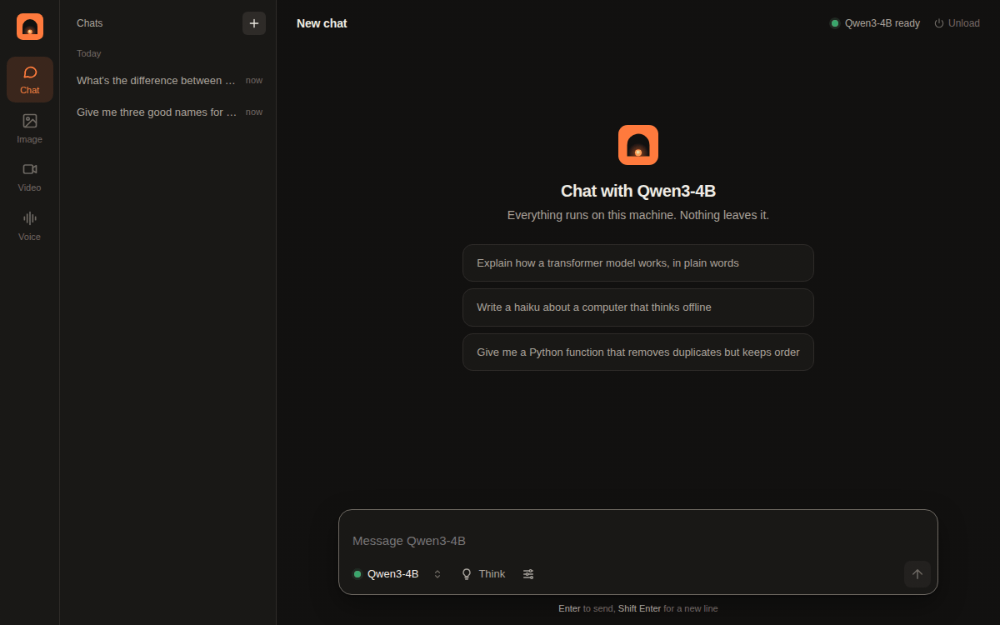
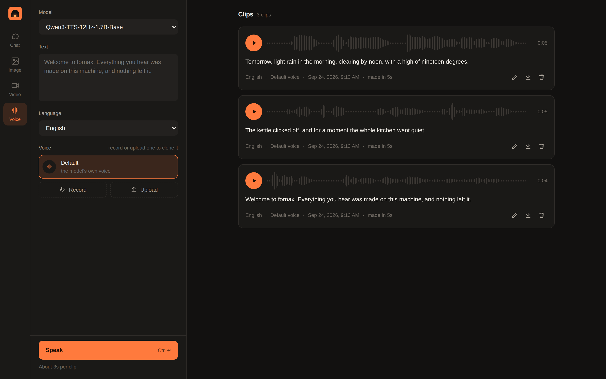

<p align="center"></p>

[](https://github.com/earshot-run/fornax/releases/latest)

[English](README.md) · [简体中文](README.zh-CN.md) · [命令参考（英文）](docs/reference.md) · [参与贡献（英文）](CONTRIBUTING.md) · [MIT 许可证](LICENSE)

fornax 在自己的电脑上运行开放模型：聊天、生成图片、视频和语音，也能让模型做出判断。数据留在本机。

```sh
curl -fsSL https://raw.githubusercontent.com/earshot-run/fornax/main/install.sh | sh
fornax studio
```

安装最新通过检查的 `main` 构建，无需 Go 工具链。



## Studio

`fornax studio` 会在浏览器中打开。选择模型后即可聊天；支持视觉的模型可以接收图片，支持音频的模型可以听你说话。聊天记录会保存下来。


图片、视频和语音也可以用文字描述生成，并在图库中查找。你还可以提供参考图来编辑图片，或用短音频克隆声音。



## 模型与镜像

在 Studio 的 **Models** 页面，可以查看适合当前电脑的聊天、图片、语音和视频模型，一键下载；也可以搜索 Hugging Face 上的 GGUF 模型，先查看大小。需要授权的模型（例如 Llama）须先在 Hugging Face 接受条款，并在该页面添加令牌。

终端中也可以直接拉取 Hugging Face 或 Ollama 模型：

```sh
fornax pull hf:Qwen/Qwen3-4B-GGUF
fornax ask hf:Qwen/Qwen3-4B-GGUF "用一句话解释 GGUF 文件是什么。"
```

如果 Hugging Face 在你所在地区访问缓慢或不可用，可为搜索、模型信息和权重下载指定 HTTPS 镜像：

```sh
HF_ENDPOINT=https://hf-mirror.com fornax pull hf:Qwen/Qwen3-4B-GGUF
```

这只是一个镜像地址示例，请自行选择可信赖的服务。模型仍按固定版本、文件大小和 SHA-256 校验；镜像**不会收到 Hugging Face 令牌**，因此私有或受限模型请取消设置 `HF_ENDPOINT`，使用官方站点。引擎及其他非 Hugging Face 下载不受影响。详见[下载说明](docs/reference.md#downloads-and-hugging-face-tokens)。

## 判断

有些模型不用于聊天，而是针对文本回答结构化问题，并给出经过校准的概率。例如分流客服工单、识别风险消息或为答案评分：

```sh
fornax judge kev-4b \
  --state "客户：这个月被重复扣款了，之前三封邮件都没有回复。" \
  --ask 'escalate|noul|今天需要人工处理吗？' \
  --ask 'topic|choice|问题属于哪类？|账单|故障|销售|其他'
```

fornax 内置 [kev](https://github.com/jaredpalmer/kev) 和 [laya](https://github.com/NandhaKishorM/laya) 两个开放模型系列，均支持 TypeSafe 的 System One API；`fornax run kev-4b` 启动的本地服务可直接供官方 TypeSafe SDK 使用。

## 显卡不够用？

可以在家里的 GPU 主机或云端 GPU 机器上运行 Studio，再从笔记本连接：

```sh
fornax studio -on me@gpu-box
```

fornax 会按硬件选择 Metal、CUDA、Vulkan 或 CPU 版本。`fornax doctor` 可以查看选择结果及原因。

## 默认安全

每次下载都绑定确切版本并验证哈希；每次运行前还会重新校验模型文件。模型服务只监听本机地址，并要求 fornax 自动生成的密钥。

## 脚本与智能体

终端还提供 `ask`、`see`、`hear`、`imagine`、`say`、`embed`、`judge`、`run` 等命令，以及供智能体使用的 MCP 服务。完整参数与行为请查阅英文[命令参考](docs/reference.md)。

## 许可证

项目采用 MIT 许可证。模型权重遵循各自的许可证。
